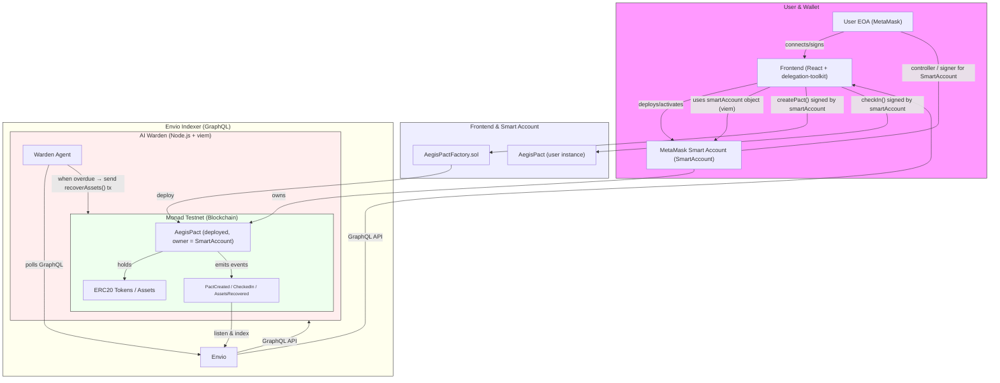
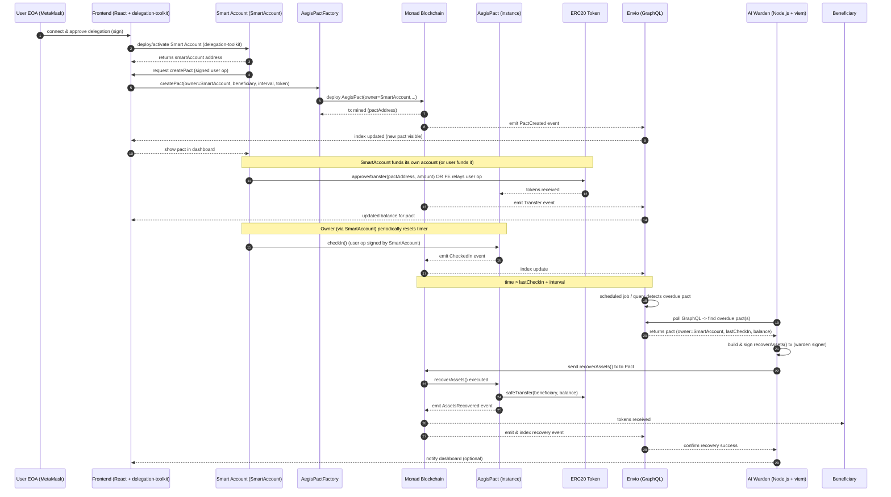

# Aegis Protocol 🛡️
### Protecting Your Digital Legacy with MetaMask Smart Accounts

Aegis is a decentralized, autonomous inheritance protocol built on Monad, powered by **MetaMask Smart Accounts**. It solves a critical problem in the crypto space: **what happens to your assets if you're gone?** Aegis provides a trustless, secure, and flexible way to manage and pass on your digital legacy.

---

## The Problem

Billions of dollars in cryptocurrency are permanently lost because owners lose access to their keys or pass away without a succession plan. Traditional legal wills are slow, expensive, and not equipped to handle on-chain assets. Standard EOA wallets have a single point of failure, making legacy planning risky and inflexible.

## The Solution: A Smart Account for Your Legacy

Aegis leverages **MetaMask Smart Accounts** to give users a sovereign, on-chain identity dedicated to legacy planning. Instead of interacting with the protocol from a vulnerable EOA, users create a secure Smart Account that acts as their personal digital vault.

This Smart Account then owns one or more **"Pacts"**—smart contracts that hold assets and are governed by a dead man's switch. If the user fails to perform a periodic "check-in," the **Aegis Warden** (an autonomous AI agent) is authorized to transfer the assets from the pact to a designated beneficiary.

By using a Smart Account, we unlock a future of advanced features like social recovery, session keys, and gasless transactions, making Aegis a true legacy management platform.

---

## How It Works: A Smart Account-Centric Architecture

The user journey and system architecture are designed around the Smart Account as the central pillar of security and identity.

[Factory Contract on Monad](https://testnet.monadscan.com/address/0xbDe71618Ef4Da437b0406DA72C16E80b08d6cD45)

**User Flow:**
1.  **Connect EOA:** The user connects their standard MetaMask wallet. This EOA acts as the initial "controller" or signer.
2.  **Activate Smart Account:** Using the `@metamask/delegation-toolkit`, the dApp helps the user deploy their own personal **Hybrid Smart Account**. This new account becomes their primary identity within the Aegis Protocol.
3.  **Manage Pacts:** The Smart Account is now the `owner` of all pacts. All transactions (creating pacts, checking in) are executed by the Smart Account, authorized by a signature from the user's EOA.

**System Components:**

1.  **Frontend (React & `@metamask/delegation-toolkit`):** The user interface manages the entire lifecycle of the user's Smart Account. It uses the toolkit to create the account and then uses the `smartAccount` object to sign and send all subsequent user operations (transactions).
2.  **Smart Contracts (Solidity):** The `owner` of each `AegisPact` is now the user's **Smart Account address**. This provides a clean separation between the user's personal wallet and their legacy planning vault.
3.  **Indexer (Envio):** A high-performance indexer that monitors all on-chain events (`PactCreated`, `CheckedIn`). It is completely agnostic to account type and seamlessly tracks pacts owned by Smart Accounts. **This is the eyes of our agent.**
4.  **AI Warden (Node.js & viem):** An autonomous backend service that monitors the Envio indexer. When it detects an expired pact, it executes the recovery function. **This is the hands of our agent.**



---

## Tech Stack & Prize Categories Targeted

This project was built to showcase a powerful, vertically integrated Web3 application centered on **MetaMask Smart Accounts**.

- **Core Technology:** **MetaMask Smart Accounts (@metamask/delegation-toolkit)**
- **Frontend:** React, Vite, TypeScript, `wagmi`, `viem`
- **Smart Contracts:** Solidity, OpenZeppelin
- **Indexer:** **Envio**
- **Backend AI Agent:** Node.js, `viem`, `graphql-request`
- **Blockchain:** Monad (Testnet)



### Highlevel Technical Features

- **AI agent:** The Warden is an autonomous, on-chain agent that makes decisions based on indexed data and executes transactions to fulfill a predefined protocol.
- **On-chain automation:** The entire process, from monitoring inactivity to executing the inheritance transfer, is fully automated and requires no human intervention after setup.
- **Consumer App:** By abstracting complexity behind a Smart Account, Aegis solves a deeply human problem with a simple, secure, and forward-looking user experience.
- **Envio:** Our Warden's efficiency is entirely dependent on Envio. It allows the agent to monitor thousands of Smart Account-owned pacts with a single, fast GraphQL query, making the system scalable and robust.

---

## Running It Locally

(This section remains the same as it is correct for the monorepo structure)

**Prerequisites:**
- Node.js (v18+)
- pnpm
- A MetaMask wallet with Monad Testnet funds.

**1. Clone the repository:**
```bash
git clone https://github.com/harishkotra/aegis-protocol.git
cd aegis-protocol
```

**2. Install all dependencies:**
Create a `pnpm-workspace.yaml` file in the root with the contents: `packages:\n  - 'indexer'\n  - 'warden'\n  - 'frontend'`. Then run:
```bash
pnpm install
```

**3. Set up Environment Variables:**
Create `.env` files in the `frontend` and `warden` directories. Use the `.env.example` files as templates.

**4. Deploy Contracts:**
Deploy `AegisPactFactory.sol` to Monad Testnet and update the address in `frontend/.env`.

**5. Run the Full Stack:**
```bash
# In separate terminals from the root directory:
pnpm --filter indexer dev
pnpm --filter warden dev
pnpm --filter frontend dev

# Or, run everything at once:
pnpm dev
```

---

## Future Improvements (Unlocked by Smart Accounts)

The Smart Account architecture is not just a feature—it's a foundation for a much more powerful future:

-   **Gasless Check-ins:** Implement a paymaster to allow users to check in without needing native tokens.
-   **Session Keys:** Delegate `checkIn` permissions to a temporary key on a mobile device for easier, secure check-ins without needing the main owner EOA.
-   **Social Recovery:** Add other trusted EOAs, hardware wallets, or passkeys as alternative signers on the Smart Account, eliminating the single point of failure of the initial EOA.
-   **Multi-Asset Pacts:** Manage multiple ERC20 tokens, NFTs, and other assets within a single, secure pact owned by the Smart Account.